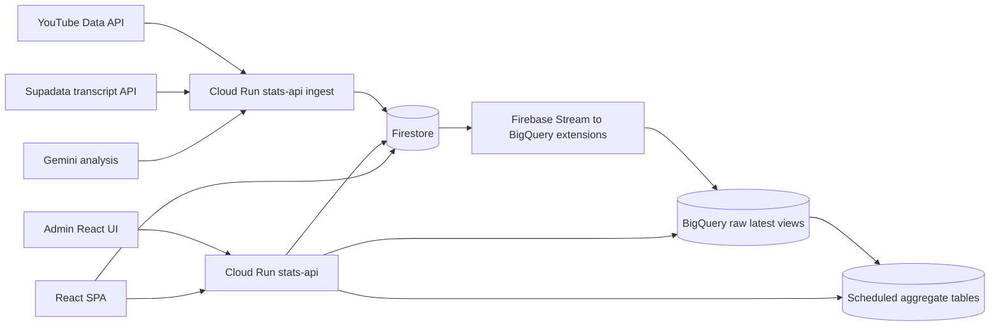

# Data Pipeline Architecture

This document describes the current Balloon data pipeline after the backend-owned write contract.

## System Overview



## Ingestion

The automated path is scheduled in Terraform:

- Cloud Scheduler runs daily at `09:00 UTC`.
- It calls Cloud Run `POST /ingest/run` with an OIDC token.
- The backend resolves the YouTube channel, scans the recent uploads playlist, filters episode titles, fetches transcripts from Supadata, analyzes transcripts with Gemini, and saves the result to Firestore.
- Comment sentiment is best-effort. If comment analysis fails, the episode analysis still saves.

The daily job scans only the most recent 50 uploads. Historical completeness depends on backfills and migration scripts under `backend/src/scripts`.

## Canonical Writes

Firestore writes for episode analysis now go through the backend:

- Automated ingest calls `saveToFirestore()` directly.
- The admin UI calls `POST /api/save` with `{ result, transcript }`.
- Browser code no longer writes `analyses`, `transcripts`, `contestants`, or `couples` directly during analysis saves.

The backend save contract rebuilds episode-scoped normalized data:

- `analyses/{ep_N}` stores the full episode analysis plus embedded contestants and couples.
- `transcripts/{ep_N}` stores raw transcript text when a transcript is provided.
- `contestants/{ep_N_normalized_name}` stores normalized contestant records.
- `couples/{ep_N_normalized_person1_normalized_person2}` stores normalized couple records.
- Existing `contestants` and `couples` documents for the same `episodeId` are deleted before the normalized rows are rewritten.

This prevents re-analysis from appending duplicate couple rows.

## Firestore Collections

Public dashboard collections:

- `analyses`
- `contestants`
- `couples`
- `episode_sentiment`
- `balloon_data`

Admin-only collections:

- `transcripts`
- `episode_comments`
- `processed_episodes`

Operational collections:

- `processed_episodes/{videoId}` records ingest idempotency.
- `episode_comments/{ep_N}` stores raw fetched YouTube comments.
- `episode_sentiment/{ep_N}` stores derived audience sentiment and top comments.

## BigQuery Export

The Firebase Stream Collections to BigQuery extension exports these Firestore collections:

- `analyses` -> `analyses_raw` and `analyses_raw_latest`
- `contestants` -> `contestants_raw` and `contestants_raw_latest`
- `couples` -> `couples_raw` and `couples_raw_latest`
- `episode_sentiment` -> `episode_sentiment_raw` and `episode_sentiment_raw_latest`
- `episode_comments` -> `episode_comments_raw` and `episode_comments_raw_latest`

The extension tables are JSON-oriented changelog tables. Query code should use `_raw_latest` views unless it explicitly needs history.

## BigQuery Transforms

Scheduled queries run every 24 hours with `WRITE_TRUNCATE`:

- `aggregated_metrics` from `contestants_raw_latest` and `couples_raw_latest`
- `aggregated_trends` from `analyses_raw_latest`
- `aggregated_locations` from `contestants_raw_latest`

`aggregated_metrics.overallMatchRate` is participant-based:

```text
matched contestants / total contestants
```

It is not the average of episode-level `matchRate` values from `analyses`.

## API Read Model

Cloud Run serves three classes of reads.

Pre-aggregated BigQuery reads:

- `GET /api/stats/overview`
- `GET /api/stats/trends`
- `GET /api/stats/locations`

Direct BigQuery `_raw_latest` reads:

- `GET /api/stats/outcomes`
- `GET /api/stats/kids`
- `GET /api/stats/religion`
- `GET /api/stats/age-gaps`
- `GET /api/stats/geo-matches`
- `GET /api/stats/best-episodes`
- `GET /api/stats/industries`
- `GET /api/stats/dealbreakers`
- `GET /api/stats/drama`
- `GET /api/stats/age-match`

Direct Firestore reads:

- `GET /api/episodes`
- `GET /api/episodes/:id`
- `GET /api/contestants`
- `GET /api/contestants/:slug`
- `GET /api/sentiment`
- `GET /api/sentiment/:id`

Conversational search uses both BigQuery and Firestore context, then asks Gemini Flash to answer from the assembled data.

## Freshness Model

Firestore-backed pages update immediately after a backend save.

BigQuery `_raw_latest` views update after the Firebase extension streams Firestore changes.

Pre-aggregated BigQuery tables update on the scheduled query cadence, so overview, trends, and locations can lag behind Firestore and raw BigQuery reads.

## Maintenance Notes

When adding a public analytics collection:

1. Add or update Firestore rules.
2. Add a Firebase BigQuery extension instance if BigQuery analytics need it.
3. Add scheduled SQL only if the endpoint needs pre-aggregated latency.
4. Update this document and the API read model.

When changing analysis schema:

1. Update the Gemini response schema in `backend/src/ingest.ts`.
2. Update frontend TypeScript types in `src/types`.
3. Update any BigQuery JSON paths in `backend/src/stats-queries.ts` and `infra/modules/bigquery/queries`.
4. Run a targeted backfill if historical rows need the new fields.
