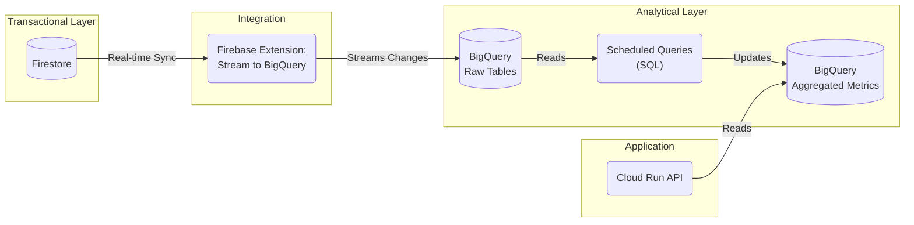

# Data Pipeline Architecture

This document describes the data pipeline for the Balloon application.

## Overview

The pipeline synchronizes data from Firestore (OLTP) to BigQuery (OLAP) in real-time and performs scheduled aggregations for the frontend dashboard.

## Components

### 1. Firestore (Source)
The operational database.
- Collections: `contestants`, `couples`, `analyses`

### 2. Stream to BigQuery (Ingestion)
We use the **Stream Collections to BigQuery** Firebase Extension.
- **Trigger**: Automatically triggered on every Firestore write.
- **Destination**: BigQuery Dataset `balloon_dataset`.
- **Tables**: `contestants_raw_changelog`, `couples_raw_changelog`, etc.
- **Views**: `contestants_raw_latest` (provides the current state of documents).

### 3. BigQuery (Transformation)
Raw data is JSON-based and potentially large. We do not query it directly from the frontend.
- **Scheduled Query**: `Daily Metrics Aggregator` runs every 24 hours.
- **Logic**: Reads from `_raw_latest` views, parses JSON, calculates aggregates (counts, averages).
- **Output**: Writes to `aggregated_metrics` table (overwrite).

### 4. Cloud Run (Consumption)
The backend API reads only from the pre-computed `aggregated_metrics` table.
- **Latency**: API response is <100ms.
- **Freshness**: Data is as fresh as the last Scheduled Query run (daily).

## Maintenance

### Adding a New Collection
1. Add a new `google_firebase_extensions_instance` in `infra/modules/firebase/main.tf`.
2. Apply Terraform.
3. Update the `metrics_aggregator.sql` query if the new data needs to be included in the dashboard.

### Schema Changes
The Raw tables store data as a JSON blob, so Firestore schema changes do not break ingestion. However, if you rename fields, you must update the SQL query in `infra/modules/bigquery/queries/metrics_aggregator.sql` to look for the new JSON keys.